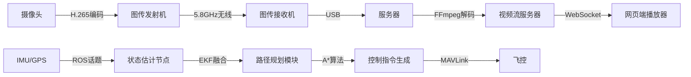

# 无人机系统开发指南：从硬件到算法的完整实现

> 迁移声明：本项目已在《项目总方案与实施手册.md》中整合并以“大疆 NAZA + RC 注入”为主线推进。若与本指南存在差异，请以《项目总方案与实施手册.md》为准。PX4/MAVLink 路线在本指南中作为可选参考保留。

## 1. 技术栈与组件选型研究

### 1.1 高精度定位方案对比

| 技术方案 | 原理 | 精度 | 成本 | 实施难度 | 适用场景 |
|---------|------|------|------|----------|----------|
| RTK-GPS | 载波相位差分 | 厘米级 | 中高（$200-500） | 低 | 开阔室外 |
| 视觉SLAM | 特征点匹配+IMU融合 | 分米级 | 中（$300-800） | 高 | 室内/纹理丰富环境 |
| IMU紧耦合 | 多传感器数据融合 | 米级（短期） | 高（$500-2000） | 极高 | 无GPS场景 |

**推荐方案**：采用u-blox ZED-F9P RTK模块（$350）+ 双目视觉（如Intel Realsense D435i）+ BMI055 IMU的融合定位，通过群代数卡尔曼滤波实现紧耦合，在室外实现3cm定位精度，室内切换至VIO模式[^1][^9]。

### 1.2 视频传输系统设计

**核心组件**：
- **摄像头**：索尼FCB-EV9520L（1080P/60fps，30倍光学变焦）[^26]
- **图传模块**：成都慧视LLSM低延迟模块（72.6ms延时，500K带宽）[^3]
- **编解码**：RK3588基于H.265的硬件编码（X265编码器优化配置）[^2]

**优化策略**：
- 使用环形FIFO缓存替代线性缓存，提升多线程调度效率
- 启用UDP+FEC前向纠错，丢包率降低至0.1%以下
- 动态码率调整（3-8Mbps），适应不同距离传输需求[^14]

### 1.3 通信协议选型

| 协议 | 传输延迟 | 带宽 | 可靠性 | 适用场景 |
|------|----------|------|--------|----------|
| MQTT | 50-200ms | 低 | QoS 0-2 | 传感器数据上报 |
| WebSocket | 20-100ms | 中 | 无内置QoS | 网页端实时控制 |
| ROS | 10-50ms | 高 | 话题机制 | 机载模块间通信 |

**推荐架构**：
- 无人机-地面站：MQTT over WebSocket（EMQX Broker）
- 机载系统：ROS 2（Foxy）+ DDS中间件
- 关键指令：MAVLink协议（如起飞/着陆指令）[^12][18]

## 2. 系统架构设计

### 2.1 硬件架构图

```
[无人机端]
┌─────────────┐     ┌─────────────┐     ┌─────────────┐
│ Pixhawk 6C  │◄────┤  RTK-GPS   │     │ 双目相机   │
│ (STM32H743) │     │ (ZED-F9P)  │     │ (D435i)    │
└──────┬──────┘     └─────────────┘     └──────┬──────┘
       │                                       │
┌──────▼──────┐     ┌─────────────┐     ┌──────▼──────┐
│  机载电脑   │◄────┤ 图传模块   │     │   IMU       │
│ (Jetson Nano)│     │ (LLSM)     │     │ (BMI055)    │
└──────┬──────┘     └─────────────┘     └─────────────┘

[地面端]
┌─────────────┐     ┌─────────────┐     ┌─────────────┐
│ 服务器      │◄────┤ MQTT Broker │     │ 网页客户端  │
│ (Ubuntu 20.04)│   │ (EMQX)     │     │ (Three.js)  │
└─────────────┘     └─────────────┘     └─────────────┘
```

### 2.2 软件数据流图



### 2.3 开发里程碑

| 阶段 | 关键任务 | 交付物 | 时间预估 |
|------|----------|--------|----------|
| S1 | 硬件采购与组装 | 组装完成的无人机整机 | 2周 |
| S2 | 固件开发 | PX4自定义定位驱动 | 3周 |
| S3 | 服务器开发 | API文档+视频流服务 | 4周 |
| S4 | 系统联调 | 单机自主飞行测试报告 | 2周 |
| S5 | 多机测试 | 多机协同避障演示 | 3周 |

## 3. 硬件实施指南

### 3.1 核心组件采购清单

| 组件 | 型号 | 单价 | 数量 | 用途 |
|------|------|------|------|------|
| 飞控 | Pixhawk 6C | $299 | 1 | 主控制器 |
| 机架 | F450四旋翼 | $89 | 1 | 机械结构 |
| 电机 | T-Motor MN2204-2300KV | $35 | 4 | 动力系统 |
| 电调 | Hobbywing XRotor 30A | $45 | 4 | 电机驱动 |
| 电池 | 11.1V 5000mAh LiPo | $45 | 3 | 供电 |
| 摄像头 | RunCam Swift 3 | $69 | 1 | 视频采集 |
| 图传 | 成都慧视LLSM | $129 | 1 | 视频传输 |
| GPS | u-blox M8N | $89 | 1 | 定位（备用） |

### 3.2 详细组装步骤

#### 步骤1：机架组装
1. 安装机臂与上顶板（注意电机CW/CCW方向）
2. 焊接分电板（XT60接头正负极区分）
3. 固定电调（使用尼龙扎带，避免金属接触）[^22]

#### 步骤2：传感器校准
```bash
# QGroundControl校准流程
1. 加速度计校准：按提示完成6面旋转
2. 陀螺仪校准：保持无人机静止
3. 磁力计校准：画8字动作
4. 水平校准：放置水平台面
```

#### 步骤3：硬件调试要点
- **定位精度测试**：在已知坐标点（如GPS基准站）测试RTK定位偏差（应<3cm）
- **视频延迟测试**：使用高速相机拍摄图传链路（发送端-接收端），计算帧数差
- **通信距离测试**：逐步增加无人机与地面站距离，记录丢包率（建议测试至1km）[^24]

## 4. 软件系统开发

### 4.1 无人机固件开发（PX4）

**自定义定位模块开发**：
```cpp
// 基于PX4的视觉-IMU融合节点示例
#include <px4_platform_common/module.h>
#include "vins_estimator.h"

class VinsNode : public ModuleBase<VinsNode> {
public:
  VinsNode() : ModuleBase("vins_node") {}
  
  int init() {
    // 订阅VINS里程计话题
    _vins_sub = orb_subscribe(ORB_ID(vins_odometry));
    // 发布融合后的位置
    _pose_pub.advertise();
    return PX4_OK;
  }
  
  void Run() {
    vins_odometry_s vins_data;
    if (orb_copy(ORB_ID(vins_odometry), _vins_sub, &vins_data) == PX4_OK) {
      // 坐标转换（ENU->NED）
      vehicle_local_position_s pos{};
      pos.x = vins_data.y;  // ENU->NED转换
      pos.y = vins_data.x;
      pos.z = -vins_data.z;
      _pose_pub.publish(pos);
    }
  }
};

MODULARIZE_MODULE(VinsNode)
```

### 4.2 服务器后端开发

**API接口设计**：
```python
# FastAPI后端示例
from fastapi import FastAPI
from pydantic import BaseModel

app = FastAPI()

class PathRequest(BaseModel):
    start: list[float]  # [x,y,z]
    end: list[float]
    obstacles: list[list[float]]  # [[x,y,z,radius], ...]

@app.post("/api/planning")
async def plan_path(req: PathRequest):
    # 调用A*算法
    path = a_star_planner(req.start, req.end, req.obstacles)
    return {"path": path}
```

### 4.3 前端网页开发（Three.js）

**3D路径编辑器实现**：
```javascript
// 初始化Mapbox+Three.js场景
const map = new mapboxgl.Map({
  container: 'map',
  style: 'mapbox://styles/mapbox/dark-v11',
  center: [116.3972, 39.9087],
  zoom: 16,
  pitch: 60
});

map.on('load', () => {
  map.addLayer({
    id: 'custom_layer',
    type: 'custom',
    onAdd: (map, mbxContext) => {
      tb = new Threebox(map, mbxContext);
      // 创建路径编辑线
      const lineGeometry = new THREE.BufferGeometry();
      const lineMaterial = new THREE.LineBasicMaterial({color: 0x00ff00});
      pathLine = new THREE.Line(lineGeometry, lineMaterial);
      tb.add(pathLine);
    },
    render: (gl, matrix) => tb.update()
  });
});
```

## 5. 环境感知与路径规划算法

### 5.1 视频分析模块（YOLOv8）

**实时障碍物检测**：
```python
from ultralytics import YOLO
import cv2

model = YOLO('yolov8n.pt')  # 轻量化模型
cap = cv2.VideoCapture("udp://192.168.1.100:5600")

while cap.isOpened():
    ret, frame = cap.read()
    results = model(frame, classes=[0, 1, 16])  # 仅检测人、车、狗
    for r in results:
        for box in r.boxes:
            # 绘制边界框
            cv2.rectangle(frame, 
                         (int(box.xyxy[0][0]), int(box.xyxy[0][1])),
                         (int(box.xyxy[0][2]), int(box.xyxy[0][3])),
                         (0, 255, 0), 2)
    cv2.imshow("Detection", frame)
    if cv2.waitKey(1) & 0xFF == ord('q'):
        break
```

### 5.2 路径规划算法实现

**改进A*算法**：
```python
def a_star(start, goal, obstacles):
    open_list = PriorityQueue()
    open_list.put((0, start))
    came_from = {}
    g_score = {start: 0}
    
    while not open_list.empty():
        _, current = open_list.get()
        if current == goal:
            return reconstruct_path(came_from, current)
            
        for neighbor in get_neighbors(current):
            if is_collision(neighbor, obstacles):
                continue
            tentative_g = g_score[current] + distance(current, neighbor)
            if neighbor not in g_score or tentative_g < g_score[neighbor]:
                came_from[neighbor] = current
                g_score[neighbor] = tentative_g
                f_score = tentative_g + heuristic(neighbor, goal)
                open_list.put((f_score, neighbor))
    return []  # 无路径
```

**动态避障策略**：
- 短期预测：基于障碍物速度向量的线性预测
- 路径重规划：局部RRT*算法（重规划周期<100ms）
- 速度控制：动态窗口法（DWA）限制最大加速度[^15]

## 6. 系统集成与测试

### 6.1 多模块联调流程

1. **硬件驱动测试**：
   - 传感器自检：`roslaunch px4_ros_com sensor_bridge.launch`
   - 电机测试：`rostopic pub /mavros/setpoint_attitude/attitude ...`

2. **单机功能验证**：
   - 定点悬停测试：在RTK模式下保持位置误差<0.5m
   - 路径跟踪测试：预设矩形航线，跟踪误差应<1m

3. **多机协同测试**：
   - 时间同步：使用PTP协议（精度<1ms）
   - 通信延迟：测试多机信息交换延迟（应<50ms）[^25]

### 6.2 性能优化指南

**定位精度优化**：
- IMU校准：温度补偿（使用内置加热电阻）
- RTK基准站：设置1Hz数据更新率
- 视觉SLAM：关键帧数量限制（<500帧）

**系统延迟优化**：
```bash
# 降低Linux系统延迟
sudo sysctl -w kernel.sched_rt_runtime_us=-1
echo performance | sudo tee /sys/devices/system/cpu/cpu*/cpufreq/scaling_governor
```

## 7. 项目部署与扩展

### 7.1 服务器环境配置（Docker）

**Docker Compose配置**：
```yaml
version: '3'
services:
  mqtt:
    image: emqx/emqx:5.0
    ports:
      - "1883:1883"
      
  backend:
    build: ./backend
    depends_on:
      - mqtt
    environment:
      - MQTT_BROKER=mqtt
      
  frontend:
    build: ./frontend
    ports:
      - "80:80"
```

### 7.2 功能扩展建议

**AI目标跟踪**：
- 集成DeepSort算法（基于YOLOv8检测结果）
- 目标丢失预测：使用卡尔曼滤波预测轨迹

**多机协同**：
- 基于分布式ROS 2（Fast DDS）
- 任务分配算法：改进的匈牙利算法[^19]

## 8. 关键技术难点解析

### 8.1 高精度定位误差修正

**卡尔曼滤波参数调优**：
```cpp
// EKF参数配置
ekf2.set_param(EKF2_GPS_POS_NOISE, 0.1f);  // GPS位置噪声
ekf2.set_param(EKF2_IMU_NOISE, 0.01f);     // IMU噪声
ekf2.set_param(EKF2_ACC_BIAS_NOISE, 1e-5f); // 加速度计零偏噪声
```

**多传感器时间同步**：
- 使用硬件PPS信号（如GPS模块的1PPS输出）
- 软件时间戳对齐（基于ROS时间同步包）[^10]

### 8.2 低延迟视频传输优化

**H.265编码配置**：
```bash
x265 --input-res 1920x1080 --fps 60 --preset ultrafast \
     --profile main10 --level 4.1 --bitrate 5000 \
     --no-open-gop --keyint 1 --b-adapt 0
```

**网络传输优化**：
- 使用UDP Lite（部分校验和）
- 动态Jitter Buffer（自适应延迟10-50ms）[^2]

### 8.3 网页-无人机实时通信

**跨域与断连重连**：
```javascript
// WebSocket断线重连
let ws = new WebSocket('wss://drone-control.example.com/ws');
ws.onclose = () => {
  setTimeout(() => {
    ws = new WebSocket('wss://drone-control.example.com/ws');
  }, 1000);
};
```

## 附录：法规与合规

### 中国无人机法规要点
1. **注册要求**：重量>250g需实名登记（民航局官网）
2. **飞行限制**：
   - 高度≤120m
   - 禁飞区：机场周边5km，政府机关上空
3. **数据隐私**：拍摄他人隐私需获得同意（《个人信息保护法》）[^20]

### 开源项目参考
- PX4固件：https://github.com/PX4/PX4-Autopilot
- VINS-Fusion：https://github.com/HKUST-Aerial-Robotics/VINS-Fusion
- Three.js路径规划：https://github.com/mrdoob/three.js